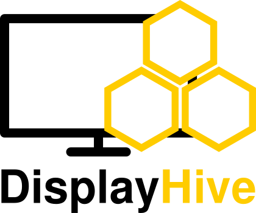

  <picture>
    <source media="(prefers-color-scheme: dark)" srcset="docs/assets/logo-dark.png">
    
  </picture>

<b>Self-hosted digital signage</b> for managing screens, content, and schedules in real time.

  <a href="https://docs.displayhive.org/">Documentation</a> ·
  <a href="https://docs.displayhive.org/user/installation/">Installation</a> ·
  <a href="CONTRIBUTING.md">Contributing</a> ·
  <a href="https://displayhive.org">Website</a>

---

DisplayHive drives networks of displays (kiosks, TVs, info screens) from a single admin
panel. Content is composed on drag-and-drop layouts with named containers, styled
instance-wide with a design, pushed to screens instantly over Socket.IO, and organized
into groups so you can target one display or a hundred at once.

## Features

- **Live content push** — changes in the admin panel appear on screens immediately via Socket.IO, no polling or refresh required.
- **Layouts & containers** — position named containers on a drag-and-drop canvas (with snapping), reuse across screens.
- **Designs** — style a layout with color palettes, gradients, and animated/dynamic backgrounds, independent of its container placement.
- **Content types** — reusable field schemas (text, image, icon, link, table, Pretalx table, date/time, WYSIWYG, ...) that populate containers.
- **Screens & groups** — register devices, assign them to screens, organize screens into groups, and manage assignments from a matrix view.
- **Live preview** — watch exactly what a screen renders from the admin panel without a physical device.
- **Demo mode** — import ready-made example content packages to explore the admin panel with data already in place.
- **Pretalx integration** — pull conference schedules from a Pretalx instance and render them as content.
- **Screens that look after themselves** — a status dot appears only when something is wrong, screens report to a stored log you can filter in the admin, reconnect with backoff, restart offline from the browser's cache, hide the pointer, keep the display awake and reload daily.
- **Dashboard & search** — see what is on air or about to end at a glance, and jump anywhere with Ctrl+K.
- **Alerting** — Telegram notifications when screens/devices go online, offline, or hit an error state.
- **Import/export** — back up or migrate any part of an instance (or all of it), by type or individual item, with dependencies auto-included; import can reset the instance or merge into existing data.
- **Rights & groups** — granular per-feature permissions, nested groups, and per-user allow/deny overrides on top of JWT-authenticated, rate-limited login.

## A few clarifying words on the current state

DisplayHive is mostly stable. Things will keep changing, but we don't expect updates to break your running system. See [Contributing](#contributing) for how to reach out or report a bug.

## Architecture

Flask + Flask-SocketIO backend (REST/API + realtime hub), a Vue 3 admin panel, and a
framework-free TypeScript screen client, all served by the same process. Deployment is Docker
or a NixOS module; PostgreSQL is the production database.

## Documentation

Everything else — installation, configuration, using the admin panel, and the internals — is in
the docs at **[docs.displayhive.org](https://docs.displayhive.org/)**.

**Getting started**

- [Installation](https://docs.displayhive.org/user/installation/) — Docker, NixOS, and a development setup
- [Getting started](https://docs.displayhive.org/user/getting-started/) — a hands-on walkthrough
- [User guide overview](https://docs.displayhive.org/user/) — how the pieces fit together

## Contributing

See [CONTRIBUTING.md](CONTRIBUTING.md) for how to get set up, PR conventions,
and our AI-assisted contributions policy. Please report security
vulnerabilities privately per [SECURITY.md](SECURITY.md) rather than as a
public issue.

## License

[MIT](LICENSE)
