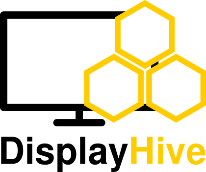
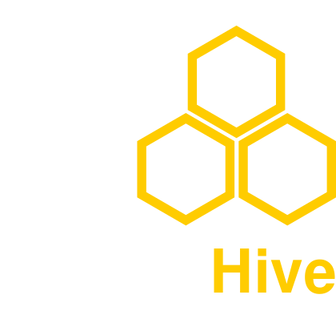

# DisplayHive

  { .brand-logo .brand-logo--light width="280" }
  { .brand-logo .brand-logo--dark width="280" }

## What is DisplayHive?

At its core, DisplayHive is a way to design a screen layout once, drop live
content into it, and have that content show up — instantly, and in sync —
across any number of displays you organize into groups. Because everything
runs on your own infrastructure, there's no per-screen subscription, vendor
lock-in, or cloud dependency: you own the templates, the content, and the
data.

That combination — self-hosted, live-updating, group-targeted — makes it a
fit anywhere you'd otherwise be manually swapping slides or printing signs:

- **Events & conferences** — pull a live schedule straight from Pretalx and
  show "what's on now / up next" boards per room, alongside wayfinding or
  sponsor content, updating automatically as the schedule shifts.
- **Offices** — meeting room availability and wayfinding at the entrance,
  a company-wide announcements screen in the break room, or a welcome
  display in the lobby — organized into screen groups per floor or
  building so each area shows only what's relevant to it.
- **Retail** — rotate promotions and price boards on a schedule (content
  can be set to only show within a given date/time window), update pricing
  instantly across every store from one place, and reuse the same content
  types for consistent branding across locations.
- **Churches & community spaces** — service times, event announcements,
  and sermon or song info on displays throughout the building, updated
  from a single admin panel without touching each screen individually.

This documentation is split into two parts:

- **[User Guide](user/index.md)** — for users managing content, screens, and
  devices through the admin panel.
- **[Developer Guide](developer/index.md)** — for contributors working on
  DisplayHive itself: architecture, the real-time push pipeline, and how to
  contribute changes.

!!! note "Early stage"
    DisplayHive is under active development. If something here is wrong, missing, or
    confusing, see [Contact](contact.md) for how to reach out.
