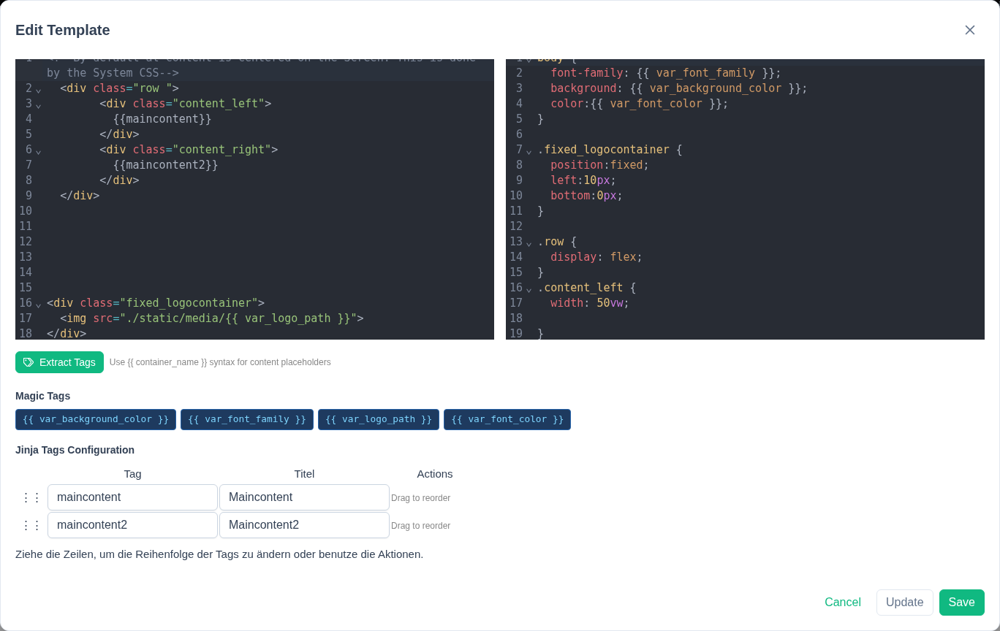
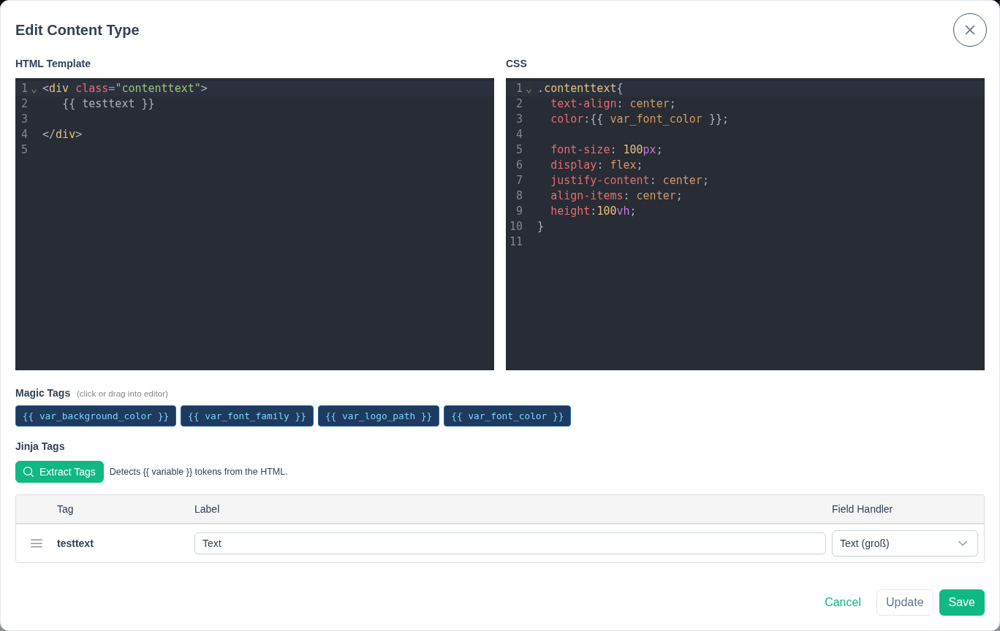
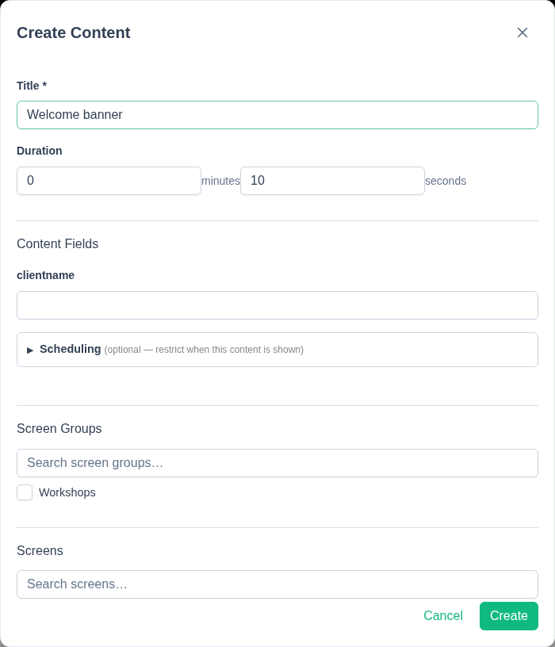

# Templates, containers & content

Getting content onto a screen involves three layers: a **template** (the page
layout), **containers** inside it (named regions), and **content** (the
actual items shown in those regions).

## Templates

A template is a full HTML/CSS document — the page a screen renders. Manage
templates from the **Templates** page (`/templates`).

- One template can be flagged as the instance **default**. Screens without
  their own template override fall back to it (the default can also be
  changed from the [Settings](settings.md) page).
- Templates are edited directly as HTML/CSS in an in-browser code editor.

### Defining containers

Containers aren't created through a separate form — you define them by
writing placeholders directly in the template HTML, anywhere you want
content to appear:

```html
<div class="main">{{ maincontent }}</div>
<div class="sidebar">{{ sidebar }}</div>
```

After editing, click **Extract tags**. DisplayHive scans the HTML for
`{{ name }}` placeholders and turns each unique name into a content
container. Containers can be reordered by drag-and-drop, and the order is
saved with the template.

{ width="700" }

!!! tip "`var_` placeholders are different"
    A placeholder named `{{ var_something }}` is **not** turned into a
    container — it's treated as a [magic tag](magic-tags.md) instead. See
    that page for details.

## Content types

A content type (**Content Types** page, `/contenttypes`) is a reusable
"shape" for content: a small HTML/CSS snippet plus a list of typed fields
that get filled in per content item. Available field types:

| Field type | Purpose |
|---|---|
| Text (short) | Short text value |
| Long text | Multi-line text |
| Link / URL | A hyperlink |
| Image | An uploaded image |
| Arrow | Directional arrow graphic |
| pretalx | A live conference schedule table — see [Pretalx](pretalx.md) |
| Table | Tabular data |
| Date/Time Format | A formatted date/time value |

Each content type also declares which container(s) it's allowed to be placed
into, chosen from a picker listing every container across all templates.

{ width="700" }

## Creating content

On the **Content** page (`/content`):

1. Pick a content type.
2. Fill in its fields, plus a title, a display duration, and an optional
   active-window start/end time (for content that should only show during a
   date/time range).
3. Assign it to a container — either automatically (the first container its
   content type allows) or manually via **Move Content**, which only offers
   containers the content type permits.

{ width="500" }

Saving pushes the change to every screen showing that content immediately —
there's no separate publish step.
