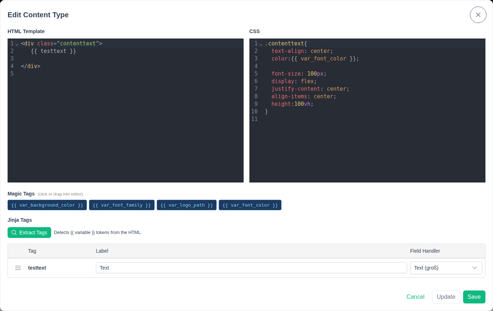
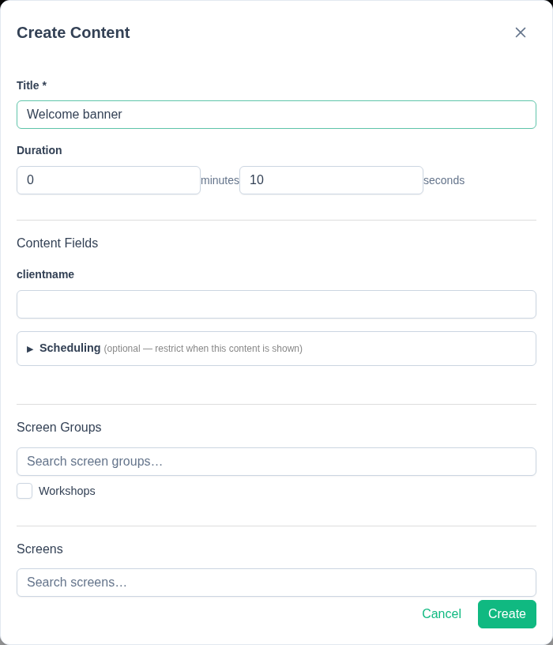

# Layouts, designs, content types & content

Getting content onto a screen involves four layers:

- a **layout** — named, positioned containers
- a **design** — the instance-wide skin (colors, backgrounds, per-container styling)
- a **content type** — a reusable field schema, bound to one layout
- **content** — an actual item, filled in from a content type's fields

## Layouts

A layout (**Layouts** page, `/layouts`) is a named, reusable group of
positioned containers. Manage it on a drag-and-drop canvas:

- Click-drag empty canvas space to draw a brand-new container, or drag an
  existing one from the picker onto the canvas to add it to the current
  layout.
- Drag a container to move it, its corner handle to resize it. Snaplines
  help align containers against the canvas edges/center and against each
  other while dragging.
- A container's position/size (top/left/width/height, in viewport-relative
  units) is shared wherever that same container is reused across layouts —
  editing it in one layout moves it everywhere it's placed.
- Each container can optionally have a **default field handler** and
  **default content**, shown whenever no active content currently targets
  it.

There's no per-screen "this screen uses layout X" assignment — a layout's
only job is to group containers and scope which containers a content type
may target.

## Designs

A design (**Designs** page, `/designs`) is the instance-wide visual skin:
backdrop color/image, one or more stacked CSS gradients, an optional
animated background effect, a named color palette (quick-pick swatches used
everywhere else in the editor), and global or per-container CSS overrides
(e.g. font styling). Exactly one design is flagged **default** and active
for every screen at a time (changeable from the [Settings](settings.md)
page). A design can also carry hand-written HTML/CSS for anything its
structured options don't cover.

## Content types

A content type (**Content Types** page, `/contenttypes`) is bound to one
**Layout** and declares one field per container that layout provides you
want to fill. Available field handlers:

| Field type | Purpose |
|---|---|
| Short text | Short text value |
| Long text | Multi-line text |
| WYSIWYG | Rich-text editor |
| Number | A numeric value |
| Link / URL | A hyperlink |
| Image | An uploaded image |
| Icon | Pick an icon from a bundled icon library |
| Arrow | Directional arrow graphic |
| Date / Time Format | A formatted date/time value |
| Table | Tabular data |
| Pretalx Table | A live conference schedule table — see [Pretalx](pretalx.md) |

Each field can be given a preset **default value**, and individual parts of
that default can be **locked** (kept editable but pre-filled) or **hidden**
(fixed, not shown at all) in the Content editor — useful for content types
that should only expose a subset of a field's options per use case.

{ width="700" }

## Creating content

On the **Content** page (`/content`):

1. Pick a content type.
2. Fill in its fields, plus a title, a display duration, and an optional
   active-window start/end time (for content that should only show during a
   date/time range).
3. Assign it to a container — either automatically (the first container its
   content type allows) or manually via **Move Content**, which only offers
   containers the content type permits.

Expanding a content row also shows a live, scaled-down preview of its actual
rendered HTML — useful for checking a change before it goes out to real
screens.

{ width="500" }

Saving pushes the change to every screen showing that content immediately —
there's no separate publish step.
