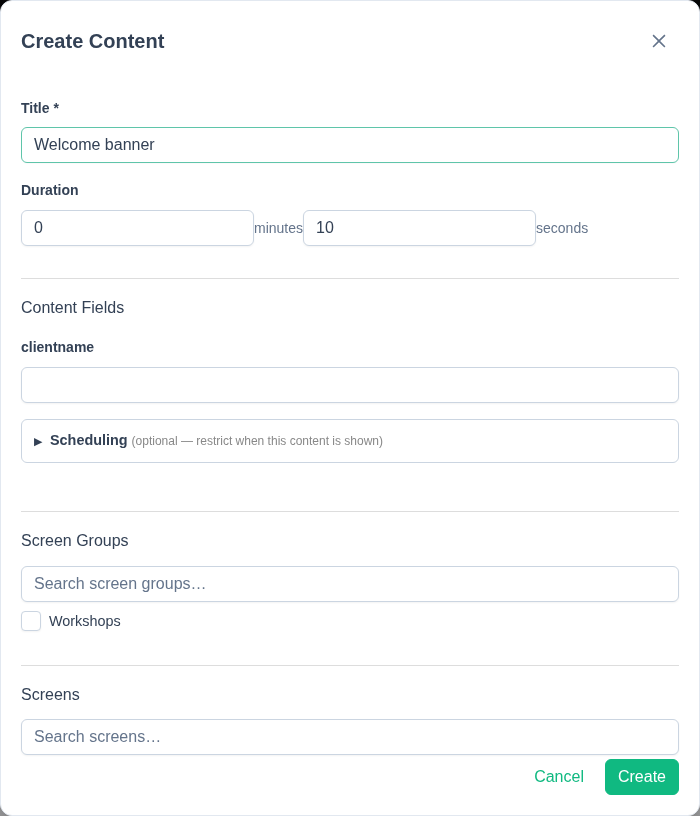

# Layouts, designs, content types & content

Getting content onto a screen involves four layers:

- a **layout** — named, positioned containers
- a **design** — the instance-wide skin (colors, backgrounds, per-container styling)
- a **content type** — a reusable field schema, bound to one layout
- **content** — an actual item, filled in from a content type's fields, assigned
  to the screens that should show it

## Layouts

A layout (**Layouts** page, `/layouts`) is a named, reusable group of
positioned containers. A dropdown at the top of the page switches which
layout you're editing; **New** starts an empty one, **Save as New**
duplicates the current layout (its containers are shared with the original,
not copied — see below), and **Delete Layout** removes it (blocked if a
content type is currently bound to it).

The canvas is a 16:9 area by default, with every container's position stored as a
percentage of it (top/left/width/height) so layouts scale to any screen
resolution. Other aspect ratios are handled as **variations** (below). The preview also renders the current default design live, so you're positioning containers against the real background rather than a blank grid.

**Aspect ratio variations:**

16:9 is the base. Extra ratios (4:3, 21:9, 9:16 …) are defined on the
**Designs** page (*Aspect Ratios*), and each **Screen** gets a ratio in its
edit dialog (default 16:9). In the layout editor, the **Aspect Ratio
Variations** card on the right lists the layout's variations; pick one to
edit it, or add one from the design's ratios (it starts as a copy of 16:9).

- Each variation has its **own set of containers** — add or remove
  containers per variation without touching the others.
- A container's **position and size are per aspect ratio**, so a logo can sit
  differently in 4:3 than in 16:9. Everything else about a container (name,
  content, design, "show when empty" …) is shared across ratios.
- A screen is sent the variation **closest to its own ratio** (16:10 gets
  16:9 if there's no 16:10 variation; 5:4 gets 4:3 …). Content previews have
  a *Preview as* switch that resolves the same way.
- The content editor always shows **all** of a content type's fields,
  whichever variation a field's container belongs to.
- Removing a variation keeps the container positions stored for that ratio.

**Adding containers:**

- Click-drag empty canvas space to draw a brand-new container, or use the
  **New Container** button to drop one in at a default size.
- Drag an existing, unassigned container in from the sidebar to reuse it in
  this layout instead of creating a new one.

**Positioning:**

- Drag a container's body to move it, or one of its four corner handles to
  resize it (the opposite corner stays anchored).
- **Snaplines** — shared globally across every layout — help align
  containers. Add one from an axis (horizontal/vertical) and a percentage
  position; it's drawn as a red guide line and can be removed again via its
  chip. While dragging, containers snap to the canvas edges/center, to the
  edges and center of every other placed container, and to snaplines,
  within a small threshold.
- Position/size edits are staged locally and only sent to the server when you
  click **Save**. Adding, removing, or deleting a container, on the other
  hand, happens immediately.

**Containers are shared, standalone entities** — a container's position/size
is the same everywhere it's used, so editing it in one layout moves it in
every other layout that includes it too. Deleting or repositioning a
container that's reused elsewhere warns you which other layouts are
affected. A container can't be deleted while a content type has a field
bound to it.

Each container can optionally have a **default field handler** and matching
**default content** — an editor tailored to that handler (color pickers,
size fields, a table builder, etc.) opens from the container's own settings.
This default is what renders whenever no active content currently targets
that container. The available handlers are: Short text, Long text, WYSIWYG,
Number, Link/URL, Image, Icon, Arrow, Date/Time Format, Countdown, Table,
Pretalx Table, Raw HTML, iFrame, Marquee (scrolling text), or None.

There's no per-screen "this screen uses layout X" assignment — a layout's
only job is to group containers and scope which containers a content type
may target (see [Content types](#content-types) below). Every screen shares
the same set of layouts and the same active design.

## Designs

A design (**Designs** page, `/designs`) is the instance-wide visual skin.
The list lets you **Make Active** (flips the one `isDefault` design — active
for every screen at once), **Copy** (duplicates HTML/CSS/description under a
new name), or **Delete** a design. The editor is a set of collapsible
panels, layered in this order (later panels win over earlier ones):

1. **Default Colors** — a named color palette scoped to this design. Every
   color picker elsewhere in the editor can either pick a one-off color or
   reference a palette entry by id; referencing entries means editing one
   palette color updates every place that references it at once, instead of
   having to change each occurrence individually.
2. **Backdrop** — a **Background** panel (image via the media picker,
   repeat/size/opacity, fallback background color) stacked with a
   **Gradient** panel: pick one or more gradients from a reusable gradient
   library (linear, radial, or conic; repeating toggle; angle or shape/size
   for radial; position; any number of color stops, each with its own color,
   position, and opacity, optionally referencing a Default Color) — multiple
   gradients layer as stacked CSS backgrounds.
3. **Background Effect** — an optional animated canvas background (particle
   fields, waves, etc.), picked from a dropdown of effect types with
   optional presets and per-effect parameters (numbers, colors, color
   arrays), with a live inline preview while you tune it.
4. **Indicator** — an optional thin bar along the bottom of the screen that
   fills over the time the current content is shown, then starts again with
   the next one. Choose whether it is shown, its **color** (including the
   design's default colors), its **height** (in % of the screen height) and
   its **direction** (left to right or right to left). It turns with the
   screen if the screen is rotated, and saving the active design reloads the
   screens so the change shows up.
5. **Global Styles** — font and layout properties (family from a websafe
   list, variant, weight, stretch, size in vh, line-height, style, color,
   text-align, display, justify-content, align-items) applied to every
   container by default. Styling for a single container (font, background,
   border, padding …) is done in the Layout editor's **Container Design**
   card instead.
6. **Custom HTML and CSS** — hand-written HTML/CSS for anything the
   structured options above don't cover; it always renders last and wins
   over every other panel.

## Content types

A content type (**Content Types** page, `/contenttypes`) has a name, an
optional description, and is bound to **one layout**. Its field list isn't
picked by hand — it's synced automatically, one field per container in the
chosen layout: switching a content type to a different layout adds fields
for that layout's containers and drops the ones that no longer apply. This
also means a content type's fields always map to real, current containers —
there's no separate "which containers can this content type target" step.

For each field you can set:

- A **title** — the label shown above the field in the Content editor and
  used as a header wherever the content renders.
- A **field handler** — the same set available for a layout container's
  default content (short text, long text, WYSIWYG, number, link/URL, image,
  icon, arrow, date/time format, countdown, table, Pretalx table — see
  [Pretalx](pretalx.md) — raw HTML, iFrame, marquee, or none). Leaving a
  field as **None** means it has no input of its own and always falls back
  to showing its container's default content. A **countdown** field counts
  down to a target date/time, with a customizable format (day/hour/minute/
  second tokens) and an optional "finished" text shown once the target has
  passed.
- Drag-to-reorder — the order fields appear in both the Content editor and
  the rendered output.

Opening a field's preset panel lets you set a **default value** for it, and
independently **lock** (kept editable, but pre-filled) or **hide** (fixed,
not shown at all) each individual part of that value in the Content editor —
for example an icon field's icon and its size can be locked/hidden
separately, and a table or Pretalx table field's many sub-options can each
be controlled on their own. This is what lets you reuse one content type for
several purposes while only exposing the parts each use case should be able
to edit.

A **Copy** action on the list duplicates a content type, including its field
configuration, under a new name.

## Creating content

On the **Content** page (`/content`), the list can be filtered by screen, by
screen group, or to just unassigned ("abandoned") content, and supports
searching by title or by any field's rendered value.

To create an item:

1. Pick a content type from the card grid.
2. Fill in a **title** and a **duration** (minutes + seconds).
3. Fill in the **content fields** — each rendered with a widget appropriate
   to its handler (a rich-text editor for WYSIWYG, an image picker with
   single-image or random-from-tag modes, an icon/size picker, a table
   editor, the full set of Pretalx table options, etc.), with any
   locked/hidden sub-options from the content type respected.
4. Optionally expand **Scheduling** to set a start/end date-time — an
   active-window outside of which the content won't show, even if otherwise
   assigned.
5. Assign it to the **screen groups** and/or individual **screens** that
   should show it, via searchable checkbox lists. There's no manual
   per-container assignment step — where the content lands on the screen is
   determined entirely by which container each field maps to in the content
   type's layout.

While editing, a live, sandboxed preview re-renders on every field change,
showing the design and layout with your in-progress values — useful for
checking a change before it goes out to real screens. If you're editing
content that's already live on one or more screens, a warning banner lists
every screen it will affect before you save.

{ width="500" }

Saving pushes the change to every screen showing that content immediately —
there's no separate publish step.

## Image sizes

Every uploaded image (PNG/JPEG) is also rendered at **FHD (1920 px)**, **4K
(3840 px)** and **8K (7680 px)** on its longer side, keeping its aspect
ratio. A size is **never larger than your original** — if the upload is
smaller than a size, that size isn't created (the original is used instead).
Screens automatically load the **next larger size than their own
resolution** (a 1920×1080 screen gets FHD, a 2560×1440 screen gets 4K),
so large uploads don't have to be sent in full to every screen. This applies
to image fields, random-image fields and the design's backdrop image.

New uploads are processed right away. Images uploaded before this existed are
processed in the background when the server starts, and again whenever you
use **Sync previews** on the Media page or import a package. The generated
copies live in `media_renditions/` inside the data directory (`DATA_DIR`, see
[Installation](installation.md#data-directory-data_dir)) and can always be
recreated from the originals.
