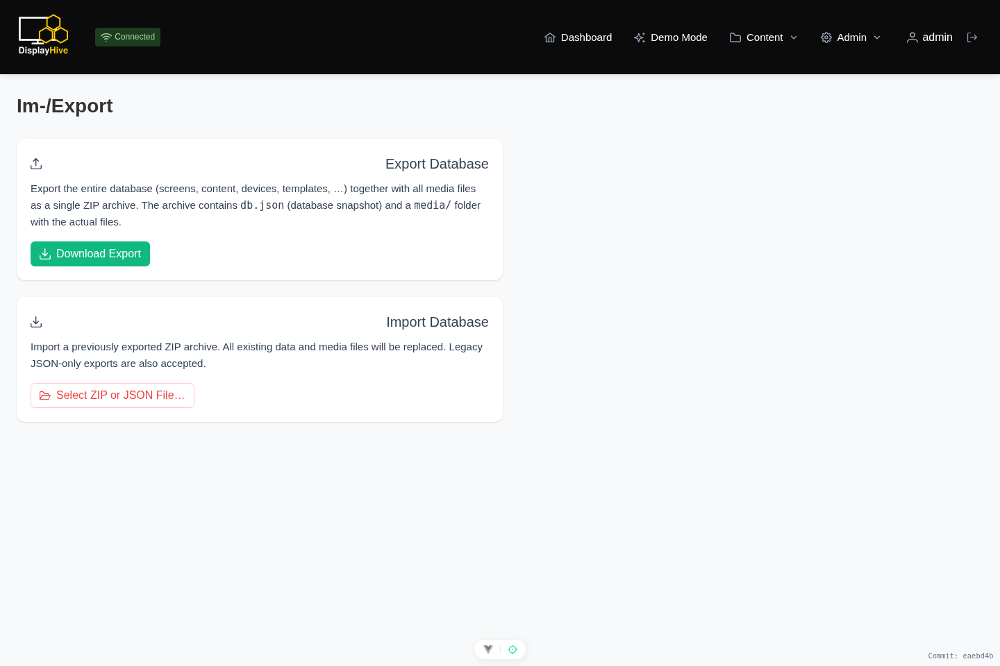

# Import & export

The **Import/Export** page (`/importexport`) backs up or migrates a full
DisplayHive instance as a single archive.

{ width="700" }

## Export

Clicking **Export** downloads a `.zip` containing:

- `db.json` — a full data dump: screens, screen groups and their membership,
  templates and containers, content types and field configs, content items,
  magic tags, and media metadata, and devices.
- `media/` — every uploaded media file referenced by that data.

## Import

Uploading a `.zip` (or a bare `.json` for data only) on this page restores
from it.

!!! warning "Import replaces, it does not merge"
    Importing fully wipes and replaces the current database contents and,
    for a `.zip`, the media folder as well. Admin user accounts are the one
    exception — they're preserved across an import. Make sure you have an
    export of the current instance if you need to keep it before importing
    something else.

This is the supported way to move an instance to a new server, or to reset
an instance back to a known state.

!!! warning "Not a complete backup"
    The export archive does **not** include admin user accounts, Telegram
    alerting configuration (bot token, subscribed users), Pretalx API
    URLs/settings, or other instance-wide system settings. Only content data
    (screens, templates, content, media, etc.) is covered.

    For a regular, complete backup, back up the database (SQL dump) and the
    media folder directly at the infrastructure level, in addition to — or
    instead of — using this export.
