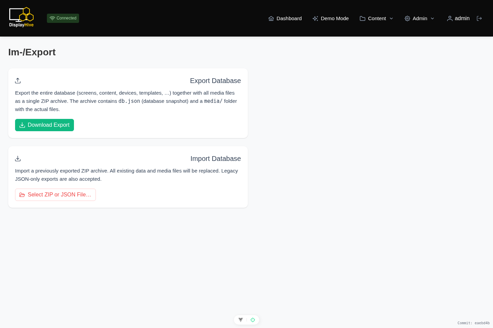

# Import & export

The **Import/Export** page (`/importexport`) backs up or migrates content
between DisplayHive instances. You pick exactly what to export or import —
by entity type, or individual items within a type — rather than being
limited to an all-or-nothing dump.

{ width="700" }

## Export

The Export panel shows a tree of everything currently in the instance,
grouped by type (Screens, Screen Groups, Designs, Gradients, Layouts,
Content Containers, Content Types, Content Elements, Media, Devices, Magic
Tags, Magic Tag Value Lists). Check the types or individual items you want,
then click **Download Export**.

- If something you selected depends on something else (a Content Type's
  Layout, a container's styling Design, an image a Content Element
  displays, and so on), that dependency is pulled in automatically — the
  export is always self-consistent, so you never end up with dangling
  references after importing it elsewhere.
- The download is a `.zip` containing `db.json` (the selected data) and a
  `media/` folder with the matching media files.
- Leaving everything checked (the default) produces the same full-instance
  export as before.

## Import

Selecting a `.zip` (or a bare `.json` for data only) doesn't import it
immediately — it's parsed and previewed first:

1. **Preview.** The file's contents are shown in the same type/item tree as
   Export, pre-checked to everything the file contains. Items that already
   exist locally (matched by a stable internal ID, not by name) are flagged
   with an **exists** badge.
2. **Choose what to import.** Narrow the selection if you only want part of
   the file.
3. **Choose a mode:**
    - **Reset whole database** — wipes the *entire* local database and media
      folder first, then imports the selection. This is the old
      all-or-nothing behavior: destructive, and not limited to the types
      you're importing.
    - **Merge into existing data** — adds the selection into the current
      database without touching anything else. Items that already exist
      locally (the "exists" badge) are left untouched by default; you can
      switch the default to overwrite them, or override individual items
      either way.
4. Click **Import**.

!!! warning "Reset wipes everything, not just what you're importing"
    Choosing **Reset whole database** deletes the *entire* local database
    and media folder before importing — including data of types you didn't
    select. Admin user accounts and the rights/groups system are the
    exception — they're always preserved. If you only want to bring in part
    of a file without touching the rest of the instance, use **Merge**
    instead.

Merge is the safe way to move a subset of content between two live
instances, or to re-import an updated export without losing local changes
to everything else. Reset remains the way to fully restore an instance to a
known state, or move it to a new server.

Exports from older DisplayHive versions (which predate per-item selection)
are still accepted — they're imported as a whole, with no selection tree.

!!! warning "Not a complete backup"
    The export archive does **not** include admin user accounts, rights/
    groups, Telegram alerting configuration (bot token, subscribed users),
    Pretalx API URLs/settings, or other instance-wide system settings. Only
    content data (screens, layouts, designs, content, media, etc.) is
    covered.

    For a regular, complete backup, back up the database (SQL dump) and the
    media folder directly at the infrastructure level, in addition to — or
    instead of — using this export.
