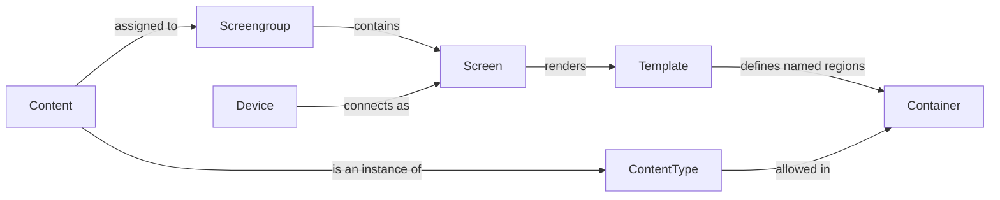

# User Guide

This guide covers day-to-day use of the DisplayHive admin panel — the web
interface where you manage templates, content, screens, and devices.

Everything here happens at `/admin/` on your DisplayHive instance and pushes
to screens live, no publish step or refresh needed.

## How the pieces fit together

DisplayHive has a handful of core concepts, each covered in its own page —
this is how they relate to each other:

In short: a **Template** is a page layout that defines **Containers**
(named regions). A **Content Type** declares which containers it's allowed
into, and **Content** is a specific item of a content type, assigned to a
**Screen Group**. Every **Screen** in that group shows it, rendered through
whichever **Template** the screen uses (its own override, or the instance
default). A **Device** is the physical/browser player that connects to a
screen. See [Templates, containers & content](content-and-templates.md) and
[Screens, devices & groups](screens-devices-groups.md) for the details
behind each box.

## Where to start

If you're setting up DisplayHive for the first time, work through these pages
roughly in order:

1. **[Installation](installation.md)** — get an instance running.
2. **[Getting started](getting-started.md)** — a hands-on walkthrough: load
   the demo content, register a device, watch a live update happen, and
   publish your own content type end to end.
3. **[Users & login](users-and-login.md)** — log in for the first time and set
   a real password.
4. **[Templates, containers & content](content-and-templates.md)** — build a
   layout and put content on it.
5. **[Screens, devices & groups](screens-devices-groups.md)** — register a
   physical/browser display and point it at your content.

Once the basics are running, see [Magic tags](magic-tags.md) for reusable
placeholder values, and [Pretalx](pretalx.md) / [Alerting](alerting.md) for
optional integrations (both experimental — see their pages for details).
[Import & export](import-export.md) covers backups,
and [Settings](settings.md) covers instance-wide options. If something's
unclear, check the [FAQ](faq.md) first.

!!! warning "No rights management yet"
    Every admin account has equal, full access — there are no roles or
    permission tiers. Only give admin accounts to people you trust with the
    whole instance.
