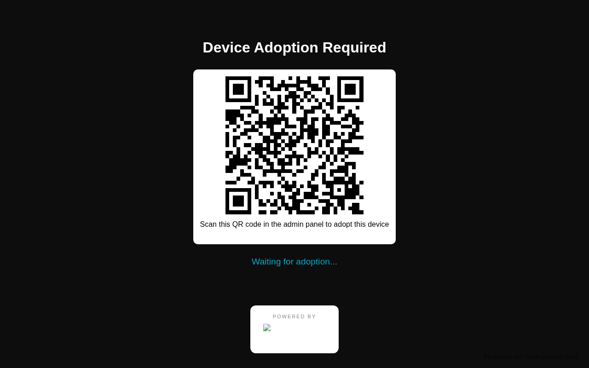
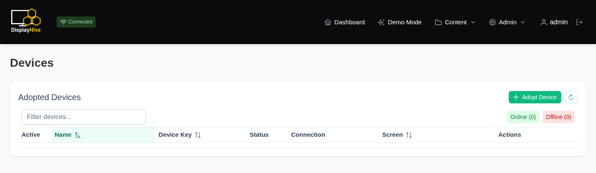
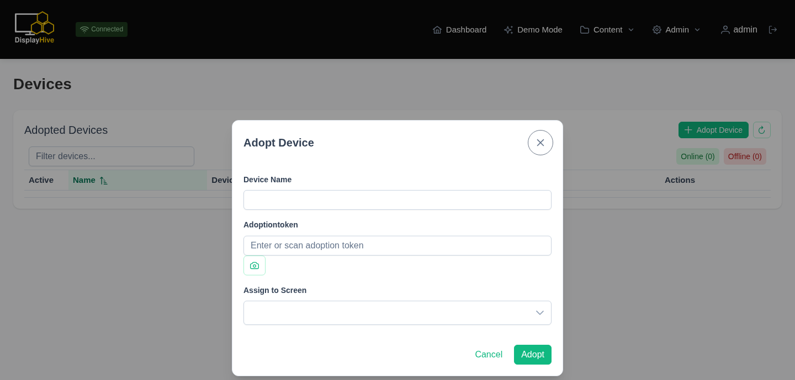
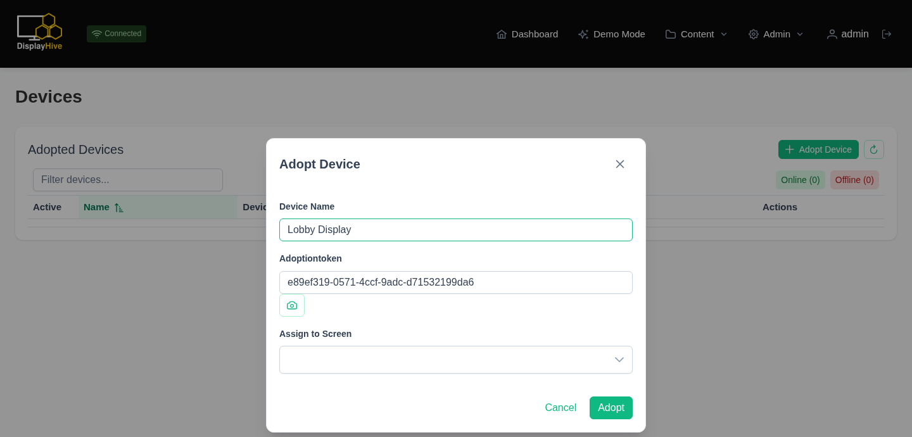
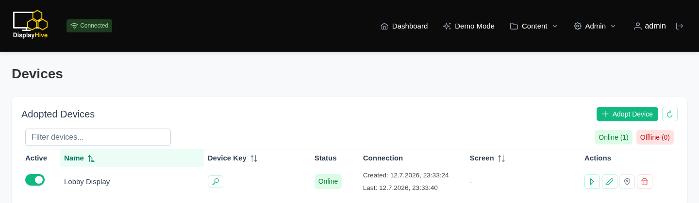

# Screens, devices & groups

DisplayHive separates the **physical device** running a browser from the
**logical screen** it displays, and content is targeted at **groups** of
screens rather than individual screens or devices.

| Concept | Page | What it is |
|---|---|---|
| Device | `/devices` | A physical/browser player that connects over Socket.IO |
| Screen | `/screens` | A logical, named display slot with its own resolution and (optional) template |
| Screen group | `/screengroups` | A set of screens that content is assigned to |
| Matrix | `/matrix` | A grid for bulk-managing which screens belong to which groups |

## Registering a device

**Step 1 — open the display.** Load the display's URL in a browser (or
kiosk app). Until it's adopted, it shows a QR code and waits:

{ width="500" }

**Step 2 — start adoption.** On the **Devices** page (empty here, before
any device is adopted), click **Adopt Device**:

{ width="700" }

**Step 3 — scan or paste the token.** In the dialog, scan the QR code with
the camera button, or paste the token manually, then give the device a
name:

{ width="450" }

**Step 4 — confirm.** With the token and name filled in — and, optionally,
a **Screen** picked from the dropdown for it to attach to right away —
click **Adopt**:

{ width="450" }

The device now shows up **Online** in the list:

{ width="700" }

This creates a `Device` record and links it to the chosen screen. You can
re-assign a device to a different screen later from its edit dialog on the
Devices page.

## Screens

A **Screen** (`/screens`) is the logical slot content actually targets: it
has a resolution, a debug flag, and optionally its own template override
(falls back to the instance default template if unset). Multiple devices
could point at the same screen, but typically it's one device per screen.

## Screen groups

Content is never assigned directly to a screen or device — it's assigned to
a **Screen Group** (`/screengroups`), and every screen in that group shows
it. This lets you broadcast the same content to many screens at once by
adding them all to one group.

## Matrix view

The **Matrix** page (`/matrix`) is the fast way to manage group membership
in bulk: rows are your active/online screens, columns are your screen
groups, and each cell is a checkbox — check it to add that screen to that
group, uncheck to remove it. This avoids opening each group individually
when you're managing many screens at once.
