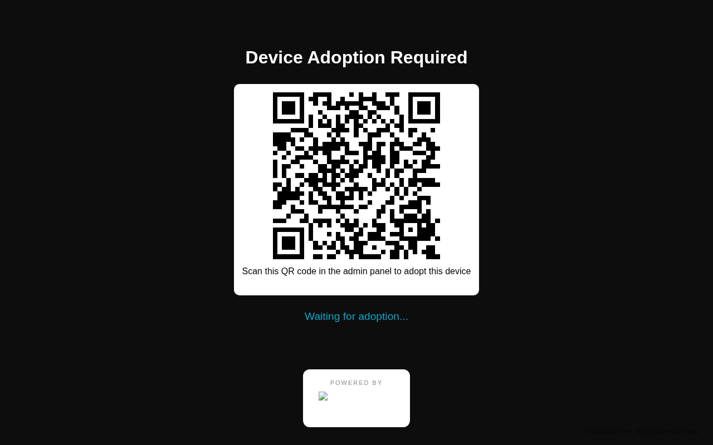
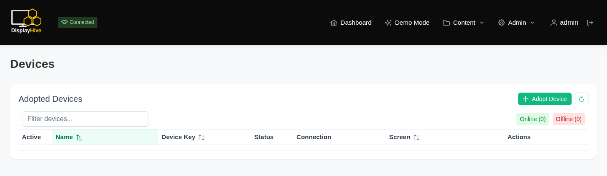
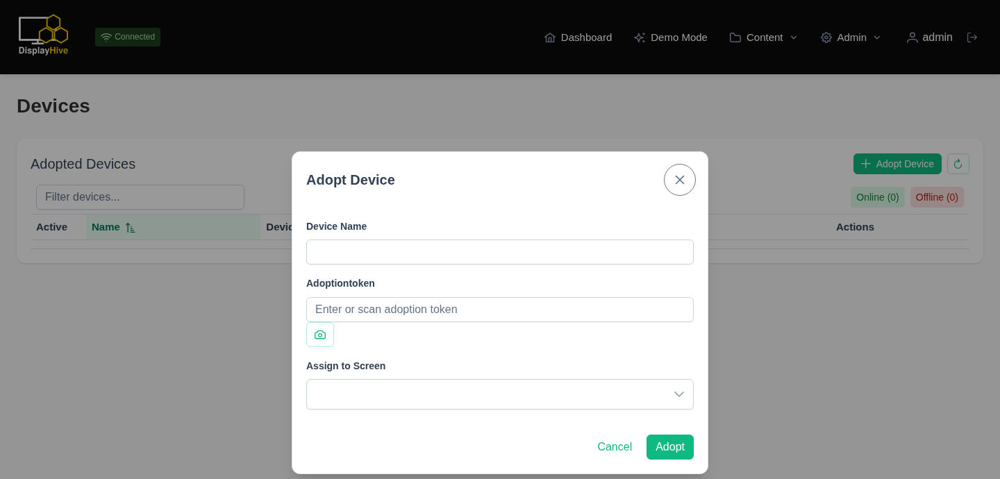
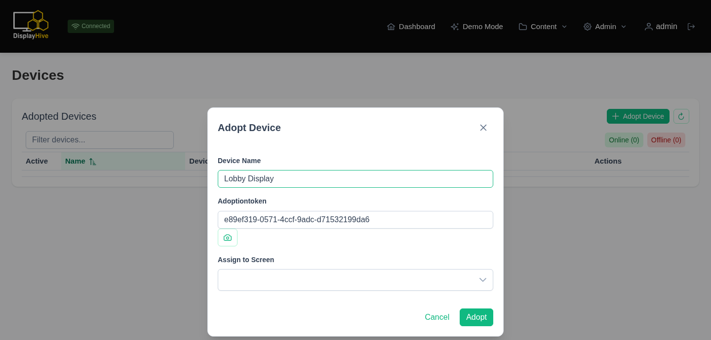
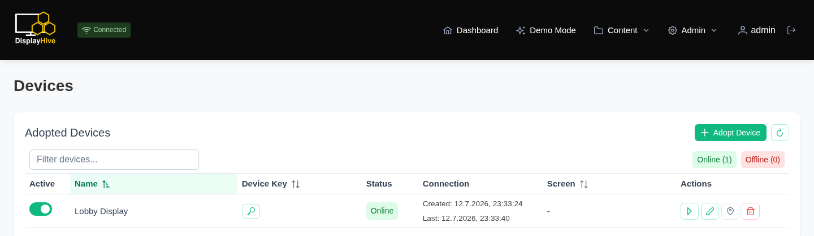

# Screens, devices & groups

DisplayHive separates the **physical device** running a browser from the
**logical screen** it displays, and content is targeted at **groups** of
screens rather than individual screens or devices.

| Concept | Page | What it is |
|---|---|---|
| Device | `/devices` | A physical/browser player that connects over Socket.IO |
| Screen | `/screens` | A logical, named display slot with its own resolution |
| Screen group | `/screengroups` | A set of screens that content is assigned to |
| Matrix | `/matrix` | A grid for bulk-managing which screens belong to which groups |

## Registering a device

**Step 1 — open the display.** Load the display's URL in a browser (or
kiosk app). Until it's adopted, it shows a QR code and waits:

{ width="500" }

**Step 2 — start adoption.** On the **Devices** page (empty here, before
any device is adopted), click **Adopt Device**:

{ width="700" }

**Step 3 — scan or paste the token.** In the dialog, scan the QR code with
the camera button, or paste the token manually, then give the device a
name:

{ width="450" }

**Step 4 — confirm.** With the token and name filled in — and, optionally,
a **Screen** picked from the dropdown for it to attach to right away —
click **Adopt**:

{ width="450" }

The device now shows up **Online** in the list:

{ width="700" }

This creates a `Device` record and links it to the chosen screen. You can
re-assign a device to a different screen later from its edit dialog on the
Devices page.

## Screens

A **Screen** (`/screens`) is the logical slot content actually targets: it
has a resolution, a monitoring toggle, and a debug flag. Every screen renders
the same instance-wide design and shares the same layouts — there's no
per-screen override. Multiple devices could point at the same screen, but
typically it's one device per screen.

Two per-screen settings are in the screen's edit dialog:

- **Aspect Ratio** (default 16:9; the ratios come from the active design) —
  decides which layout variation the screen is sent: the one closest to this
  ratio.
- **Rotation** (None, +90°, -90°, 180°) — turns everything the screen
  renders as one piece, as if all of it sat on one rotated backdrop, for
  displays mounted sideways or upside-down. The layout is laid out at the
  screen's aspect ratio first and then rotated, so for a portrait-mounted
  16:9 panel you'd pick a 9:16 ratio and rotate ±90°.

Changing either one reloads the screen's devices.

## Screen groups

Content is never assigned directly to a screen or device — it's assigned to
a **Screen Group** (`/screengroups`), and every screen in that group shows
it. This lets you broadcast the same content to many screens at once by
adding them all to one group.

## Matrix view

The **Matrix** page (`/matrix`) is the fast way to manage group membership
in bulk: rows are your active/online screens, columns are your screen
groups, and each cell is a checkbox — check it to add that screen to that
group, uncheck to remove it. This avoids opening each group individually
when you're managing many screens at once.

## What a screen does on its own

A screen page keeps running when things go wrong, and tells you about it.

**Status dot.** A small dot with codes appears in the top-left corner of the screen **only when something
is wrong** — nothing is shown while all is well:

| Colour | Code | Meaning |
|---|---|---|
| red | `con` | The connection to the server is down. It goes away when the screen is back. |
| yellow | `mim` | Content is missing: there is nothing to show, or a picture or video did not load. |
| yellow | `js` | A script error on the page (clears itself after five minutes without a new one). |

Red wins over yellow. Hover the dot for the reason. You can switch the dot off under
[Settings](settings.md) → **Screens**; the codes are still written to the screen log.

**Screen log.** The **Logger** page shows what screens report about themselves, live, and also what
they reported earlier: the log is stored on the server. Filter by screen, severity and text, and load
older lines on demand. Screens always report warnings and errors; debug and info lines are sent while
someone has the Logger page open. How long lines are kept is set under Settings → **Screens** (72 hours
and 250,000 lines by default).

**Reconnecting and offline.** After losing the server a screen retries by itself, quickly at first and
then every 30 seconds at most, and every screen picks a slightly different moment so that a restarting
server is not hit by all of them at once. A screen that was loaded once also keeps its page, its files and
its last content in the browser: if it is restarted while the server is unreachable (a power cut, the
network is down), it starts again and shows the last content until the server answers. This offline start
needs the screen to be opened over **https** (or on `localhost`); on plain `http` from another machine the
browser offers no such storage, and the screen simply needs the server to start.

**Daily reload.** Under Settings → **Screens** you can have screens reload themselves once a day at a
given time (in the instance's time zone). A reload picks up a new release of the screen page and clears
whatever a browser that has been running for weeks has collected. A screen without a connection waits
until it is back. A screen also reloads a few seconds after a new release of the page was installed.

**Pointer and sleep.** The mouse pointer disappears after a few idle seconds and returns when the mouse
moves. Where the browser allows it (https or `localhost`), the screen also asks the system not to switch
the display off.
